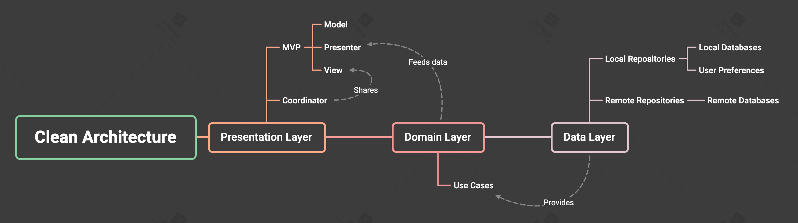
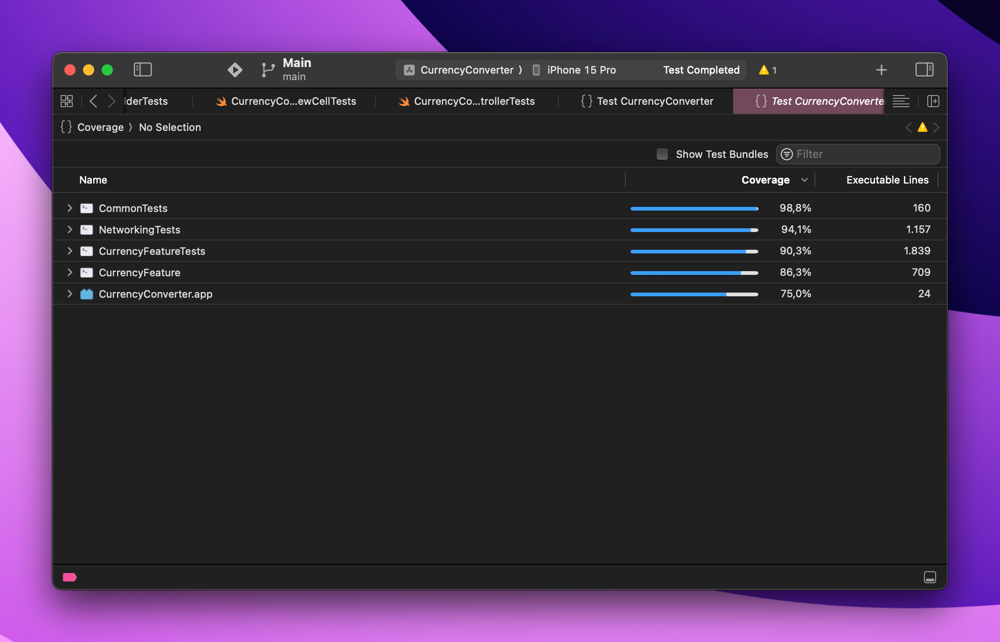

# Demo

	

# Installation

Just open the `Main.xcworkspace` file and choose simulator then press run button

# Functionalities completed

- [x] The required data must be fetched from the open exchange rates service.
- [x] In order to limit bandwidth usage, the required data can be refreshed from the API no more frequently than once every 30 minutes.
- [x] The user must be able to select a currency from a list of currencies provided by open exchange rates.
- [x] The user must be able to enter the desired amount for the selected currency.
- [x] The user must then be shown a list showing the desired amount in the selected currency converted into amounts in each currency provided by open exchange rates.
- [x] If exchange rates for the selected currency are not available via open exchange rates, perform the conversions on the app side.
- [x] The project must contain unit tests that ensure correct operation.

**More technical completed**

- [x] Unit Tests
- [x] Accessibility (A11y)
- [x] Swift 5.9
- [x] Support from iOS 13.0
- [x] Clean + MVP architecture

# 1. Architecture

## MVP + Clean architecture

The app is using Clean + MVP + Modular architecture. It is a very clean architecture. It isolates each module from others. Improving code bases or fixing bugs very easy since you only have to update a specific module or specific layer.

Some advantages key of MVP + Clean architecture:
- Good for medium-large teams.
- Scalable. Enable developers to simultaneously work on it seamlessly as possible.
- Easy to add new features.
- Easy to add tests since each layer is separated from the other.
- Easy to track bugs
- Applies SOLID principles.
- Reduces the number of conflicts within the development team.

## Modular architecture

A modular architecture is a software design technique that emphasizes separating the functionality of a program into independent, interchangeable modules, such that each one contains everything necessary to execute only one aspect of the desired functionality.

Some key points:
- **Business reasons**
	- The company requires that parts of the codebase are reused and shared across projects, products and teams
	- The company requires multiple products to be unified into a single one
- **Tech reasons**
	- The codebase has grown to a state where things become harder and harder to maintain and to iterate over
	- Development is slowed due to multiple developers working on the same monolithic codebase
	- Besides reusing code, you need to port functionalities across project/products
- **Multiple teams**
	- The company structured teams following strategic models (e.g. Spotify model) and functional teams only work on a subset of the final product;
	- Ownership of small independent modules distributed across teams enables faster iterations;
	- The much smaller cognitive overhead of working on a smaller part of the whole product can vastly simplify the overall development.

# 3. Unit Test

The app is using Test Double technique as unit test.

A Test Double is an object that can stand in for a real object in a test, similar to how a stunt double stands in for an actor in a movie.

More info: https://martinfowler.com/bliki/TestDouble.html

# 4. Cache

- We have several caching mechanisms to consider such as key-value cache, LRU cache, local database, keychain...
- In this app, we just need to cache the forecasts data to reduce APIs calls, we don't care about security since not any data that really important, so key-value cache is the best fit for us since:
  - Easy to implement
  - Easy to use
  - Very lightweight, it does not affect the storage of user's devices.
- The cache layer is using the hash map to get and set data with fast access, insert time complexity constant time in the best case and linear time in the worst case.

# Test Coverage: 91%

